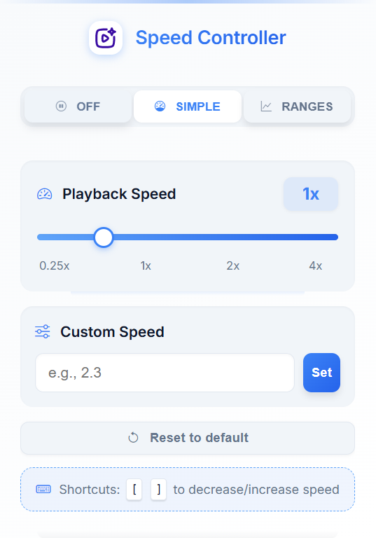

# Flow Control - Smart Video Speed Controller

**Flow Control** is a powerful Chrome extension that puts you in charge of video playback speed. It remembers your preferences for each website and can even adjust speed automatically based on video length.

 <!-- Optional: Add a screenshot if you have one -->

## Features

- **Precise Speed Control:** Adjust playback from 0.25x to 4.0x, with options for custom speeds.
- **Per-Site Memory:** Remembers your preferred speed settings for each website.
- **Smart Speed Ranges:** Set different default speeds based on video duration (e.g., faster for longer videos).
- **Auto-Apply:** Automatically applies your saved settings when you load a new video on a known site.
- **Works Everywhere:** Compatible with YouTube, Netflix, educational platforms (Coursera, Udemy), and most sites using HTML5 video.
- **Intuitive Interface:** Modern, clean UI with simple controls and a visual editor for speed ranges.
- **One-Click Reset:** Easily reset the speed to the default 1.0x.

## Installation

As Flow Control is not yet on the Chrome Web Store, follow these steps to install it manually:

1.  **Download:**
    - Go to the [Flow Control GitHub Repository](https://github.com/thisisdkyadav/Flow-Control).
    - Click the green "Code" button, then select "Download ZIP".
    - Alternatively, clone the repository using Git: `git clone https://github.com/thisisdkyadav/Flow-Control.git`
2.  **Unzip:** If you downloaded the ZIP file, extract its contents to a folder on your computer.
3.  **Enable Developer Mode:**
    - Open Google Chrome.
    - Navigate to `chrome://extensions/`.
    - In the top-right corner, turn on the "Developer mode" toggle switch.
4.  **Load Extension:**
    - Click the "Load unpacked" button that appears.
    - In the file browser, navigate to the folder where you downloaded/cloned the repository.
    - Select the **`extension`** subfolder inside the main project folder.
    - Click "Select Folder".
5.  **Ready!** The Flow Control icon should now appear in your Chrome toolbar (you might need to click the puzzle piece icon to pin it).

## Usage

1.  **Navigate:** Go to any website containing an HTML5 video.
2.  **Click Icon:** Click the Flow Control extension icon in your toolbar.
3.  **Control Speed:**
    - **Simple Mode:** Use the slider or input field to set a fixed speed for the current site.
    - **Ranges Mode:** Switch to the "Ranges" tab to define different speeds based on video length using the visual editor.
4.  **Apply:** Your settings are automatically saved and applied for the current website. The next time you visit, Flow Control will use your saved preferences.

## Contributing

Found a bug or have a feature request? Feel free to [open an issue](https://github.com/thisisdkyadav/Flow-Control/issues) on GitHub.

## Contact

Developed by [thisisdkyadav](https://github.com/thisisdkyadav). You can reach out via email at [thisisdkyadav@gmail.com](mailto:thisisdkyadav@gmail.com).

## License

This project is open source and available under the [MIT License](https://github.com/thisisdkyadav/Flow-Control/blob/main/LICENSE).
